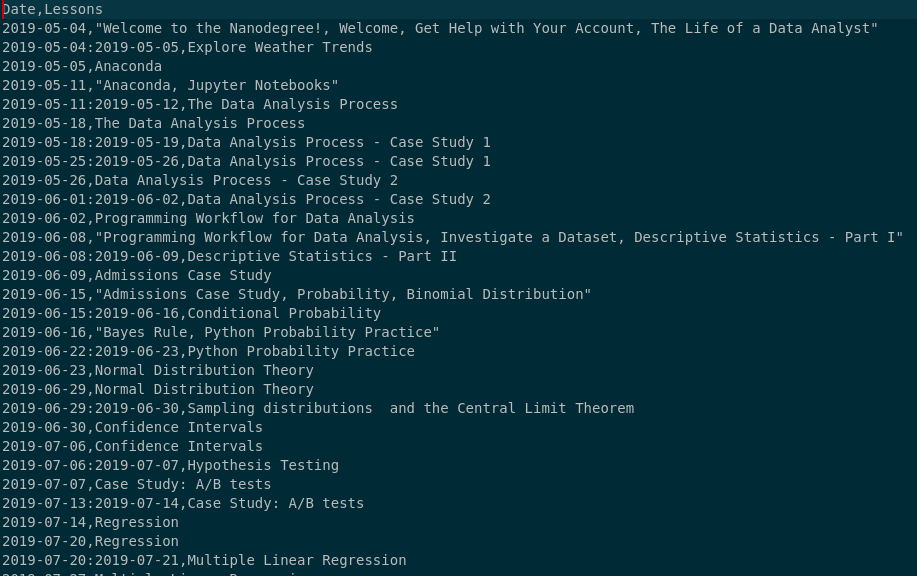

## Learning-plans
This repository contains the code for automating learning plan generation for all nanodegree. 

### Dependencies
 - Python >= 3.6
 - Pandas >= 0.20

 ### Installation
 There is no set up required. To run the script on your system, install the dependencies and clone this repository.

 ### Usage
 The script can be invoked with:

```python study-plan.py```

It takes a number of mandatory arguments. The arguments are described below. You can also print the help by executing:

```python study-plan.py --help```

```
usage: study-plan.py [-h] [--duration DURATION] [--expected EXPECTED]
                     [--start START] [--daily DAILY [DAILY ...]]

optional arguments:
  -h, --help            show this help message and exit
  --duration DURATION   Path to CSV file containing lesson-wise durations.
  --expected EXPECTED   Expected commitment in hours per week.
  --start START         Classroom open date - format YYYY-MM-DD:<UTC Offset as
                        +/-hh:mm>.
  --daily DAILY [DAILY ...]
                        Either a single number for the daily commitment in
                        hours or a list of seven numbers for each weekday's
                        commitment.
```
Here are the arguments in lexicographic order along with their parameters: 

- `daily` specifies the number of **hours** a student has committed to study. It could either be a single number like `--daily 2.5 ` or a list of seven numbers as in `--daily 1 1 1 1 1 2.5 2.5`. The former case assumes equal commitment on all days of the week, while the later explicitly specifies the number of hours committed for each day, with the week considered starting on a Monday.  

- `duration` argument takes an absolute path to a CSV file that has lesson durations for every lesson in an nanodegree. The expected structure of the file is described in the section [Input CSV]() below.

- `expected` specifies the expected number of hours per week recommended by Udacity and usually varies between 10 hours/week and 15 hours per week.

- `start` specifies the start date for the student. This must be specified in **YYYY-MM-DD:hhmm** format, where the `hhmm` is the offset from UTC, for example, `--start 2019-05-01:-0400` specifies that the student starts on May 1, 2019 in a timezone 4 hours behind GMT.


### Input CSV 

The input CSV should list down the duration for every lesson in a nanodegree. There should be two columns in the CSV -- **"Lesson"** and **"Duration"** delimeted by a **comma**. The header row should have these column names. The **Lesson** column should contain lesson names, ideally enclosed in double quotes to avoid any commas in the lesson name being confused as a column delimiter. The **Duration** column should have lesson durations in weeks, days, hours or minutes. Duration and units should be separated by whitespace. The unit can either be written out in full or abbreviated. For supported abbreviations look at the source code that parses this field:

```
if unit in ['mins', 'minute', 'minutes']:
    time_spec['mins'] += time
elif unit in ['hour', 'hours']:
    time_spec['hours'] += time
elif unit in ['day', 'days']:
    time_spec['days'] += time
elif unit in ['week', 'weeks']:
    time_spec['weeks'] += time
else:
    raise ValueError('Invalid unit %s when trying to parse %s'%(unit,tmp))
```
Here is how a CSV should look like:

```
"Lesson","Duration"
"Welcome to the ND","30 mins"
"Stock Prices","30 mins"
"Market Mechanics","30 mins"
"Data Processing ","30 mins"
"Stock Returns","30 mins"
"Momentum Trading","30 mins"
"Project: Trading w/ Momentum","1 week"
```

### Sample Invocation
The repository contains samples of lesson duration CSV in the `inputs`
folder. A sample invocation of the script will look like this:

```python study-plan.py --duration inputs/nd002.csv --start 2019-05-01:-0400 --daily 0 0 0 0 0 2 2 --expected 12```


### Output Plans:
Output plans are saved to the `plans` directory. The name of the CSV file is derived from the name of the input CSV and the weekly commitment string generated from the user input. A typical output plan looks like this:

